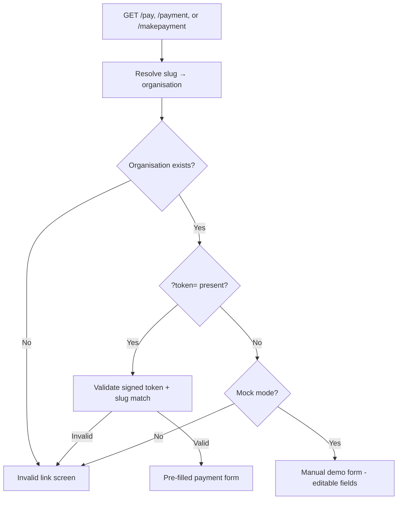
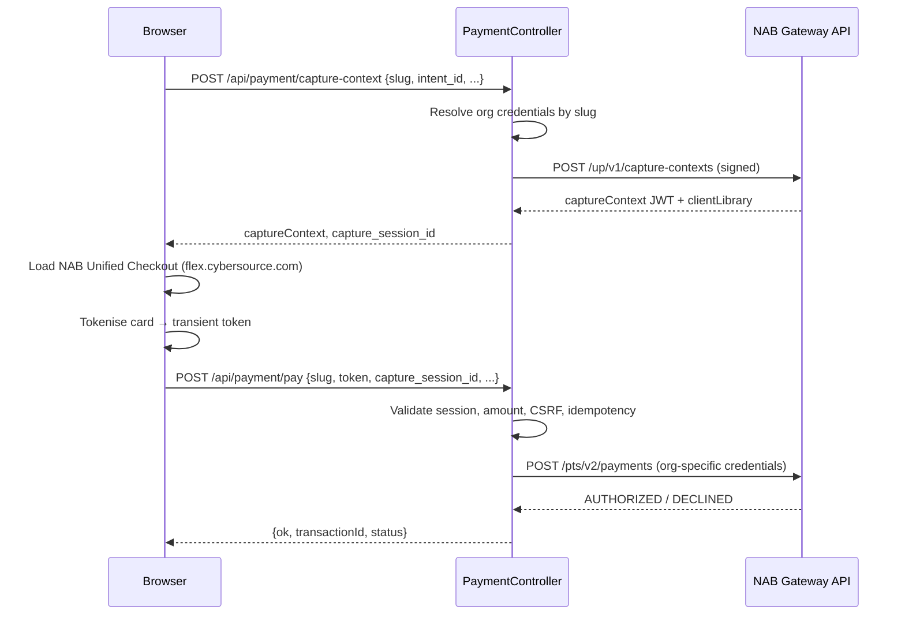
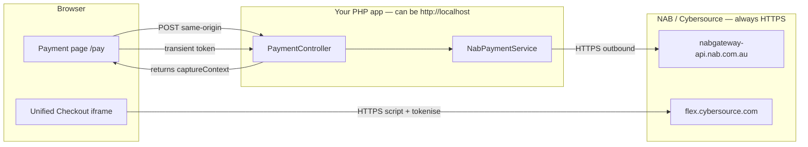

# Payment Routes Documentation

This document describes how the three payment URLs work, how funds route to three NAB merchant accounts, and what is required for live transactions on localhost.

---

## 1. `/payment` and `/makepayment` — Shared Flow, Not Redirects

These routes do **not** redirect to `/pay`. Each URL is its own entry point and stays on that path for the whole checkout.


| Route          | Controller method   | Internal slug | State / entity        |
| -------------- | ------------------- | ------------- | --------------------- |
| `/pay`         | `showPay()`         | `pay`         | Queensland (QLD)      |
| `/payment`     | `showPayment()`     | `payment`     | New South Wales (NSW) |
| `/makepayment` | `showMakePayment()` | `makepayment` | Victoria (VIC)        |


All three call the same private `show()` method with a different slug:

```php
public function showPay(Request $request): Response
{
    return $this->show($request, 'pay');
}

public function showPayment(Request $request): Response
{
    return $this->show($request, 'payment');
}

public function showMakePayment(Request $request): Response
{
    return $this->show($request, 'makepayment');
}
```

### Page load flow




**Signed link flow** (`?token=...`):

1. Token is verified and stored in Redis (`activateSignedToken`).
2. Token `slug` must match the route slug (`/payment` requires `slug: payment`).
3. For invoice-linked tokens, the invoice is re-checked (amount, paid/expired).
4. User sees a pre-filled form with readonly fields.

**Mock/demo flow** (no token, mock mode only):

1. A temporary intent is created in Redis.
2. User can enter amount, reference, email, and card details locally (mock card UI).
3. Cards ending in `0000` simulate decline; others approve.

**Live flow without token**:

- Shows **"This payment link is no longer valid"** — manual entry is only allowed in mock mode.

### Shared UI, slug carried through API calls

The Twig template injects the slug into the browser:

```javascript
window.__PAYMENT__ = {
  slug: {{ slug|default('pay')|json_encode|raw }},
  ...
  captureContextUrl: '/api/payment/capture-context',
  payUrl: '/api/payment/pay'
};
```

The frontend sends `slug` on every API call. The backend uses it to pick credentials and validate the session:

```javascript
function capturePayload() {
  return {
    slug: state.slug,
    intent_id: state.intentId,
    amount: state.amount,
    reference: state.reference,
    ...
  };
}
```

```javascript
body: JSON.stringify({
  slug: state.slug,
  intent_id: state.intentId,
  capture_session_id: state.captureSessionId,
  idempotency_key: state.idempotencyKey,
  token: state.token,
  nonce: state.nonce
})
```

### End-to-end payment sequence (live mode)




---

## 2. Three Organisations → Three Merchant Accounts

Organisation mapping is defined in `PaymentOrganisationRepository`:


| URL slug      | State                 | Env prefix |
| ------------- | --------------------- | ---------- |
| `pay`         | Queensland (QLD)      | `NAB_QLD`  |
| `payment`     | New South Wales (NSW) | `NAB_NSW`  |
| `makepayment` | Victoria (VIC)        | `NAB_VIC`  |


Each organisation has its own NAB credentials in `.env`:


| Organisation    | URL            | Env prefix | Variables                                                   |
| --------------- | -------------- | ---------- | ----------------------------------------------------------- |
| Queensland      | `/pay`         | `NAB_QLD`  | `NAB_QLD_ORG_ID`, `NAB_QLD_KEY_ID`, `NAB_QLD_SHARED_SECRET` |
| New South Wales | `/payment`     | `NAB_NSW`  | `NAB_NSW_ORG_ID`, `NAB_NSW_KEY_ID`, `NAB_NSW_SHARED_SECRET` |
| Victoria        | `/makepayment` | `NAB_VIC`  | `NAB_VIC_ORG_ID`, `NAB_VIC_KEY_ID`, `NAB_VIC_SHARED_SECRET` |


Credentials are read at request time from the environment — never stored in code.

When a payment is processed, `NabPaymentService::processPayment($slug, ...)` resolves credentials for that slug and sends them as the `v-c-merchant-id` header to NAB.

So:

- A payment on `**/pay**` → `NAB_QLD_*` → Queensland merchant account
- A payment on `**/payment**` → `NAB_NSW_*` → NSW merchant account
- A payment on `**/makepayment**` → `NAB_VIC_*` → Victoria merchant account

The same app and UI serve all three; only the URL slug (and matching token slug, if used) decides which NAB Organisation ID receives the funds.

Shared brand settings (same for all orgs):

- `PAYMENT_MERCHANT_NAME`
- `PAYMENT_SUPPORT_EMAIL`
- `PAYMENT_REQUIRE_EMAIL`

---

## 3. Live Transactions on Localhost with Production Credentials

**Yes, it is possible in principle** — the app does not block localhost for live NAB calls. Server-side requests go to NAB over HTTPS regardless of where the app runs. See [§4 Where HTTPS requests are sent](#4-where-https-requests-are-sent) for the full request path breakdown.

What matters is environment variables, credentials, and how you open the page.

### Required `.env` settings

```env
# Use production NAB gateway
NAB_ENVIRONMENT=live
# or: NAB_ENVIRONMENT=production

# Force real API calls (do not mock)
NAB_MOCK=false

# Production credentials per organisation
NAB_QLD_ORG_ID=...
NAB_QLD_KEY_ID=...
NAB_QLD_SHARED_SECRET=...

NAB_NSW_ORG_ID=...
NAB_NSW_KEY_ID=...
NAB_NSW_SHARED_SECRET=...

NAB_VIC_ORG_ID=...
NAB_VIC_KEY_ID=...
NAB_VIC_SHARED_SECRET=...

# Optional shared settings
PAYMENT_MERCHANT_NAME=Krost
PAYMENT_SUPPORT_EMAIL=accounts@krost.com.au
PAYMENT_REQUIRE_EMAIL=true
PAYMENT_INTENT_SECRET=...   # for signed payment links
```

### How `resolveMode()` decides live vs mock


| `NAB_MOCK` | `NAB_ENVIRONMENT`     | Credentials | Result                      |
| ---------- | --------------------- | ----------- | --------------------------- |
| `true`     | any                   | any         | Always mock                 |
| `false`    | any                   | any         | Always live NAB API         |
| unset      | `test` (default)      | incomplete  | Mock                        |
| unset      | `test`                | complete    | Live **test** gateway       |
| unset      | `live` / `production` | incomplete  | Attempts live call (fails)  |
| unset      | `live` / `production` | complete    | Live **production** gateway |


Production API host: `nabgateway-api.nab.com.au`
Test API host: `nabgateway-api-test.nab.com.au`

### How `/pay` handles a live localhost transaction

1. **Page access**
  On live mode without `?token=`, you get the invalid-link screen. For live testing you need a signed link, e.g.
   `http://localhost:8080/pay?token=<signed-token>`
   The token must include `"slug": "pay"` (or `"payment"` / `"makepayment"` for the other routes).
2. **Capture context**
  When the user continues to payment, the server builds `targetOrigin` from the request:
   On plain `http://localhost`, that becomes `http://localhost` (or `http://localhost:PORT`). NAB must accept that origin for Unified Checkout.
3. **Card capture (browser)**
  In live mode the app loads NAB Unified Checkout from `flex.cybersource.com` (allowed in CSP). The card is tokenised in the browser; the PAN never hits your server.
4. **Payment capture**
  `POST /api/payment/pay` validates same-origin, CSRF, rate limits, capture session, and amount, then calls NAB with the slug's production credentials. Approved statuses: `AUTHORIZED` or `PARTIAL_AUTHORIZED`.

### Practical localhost considerations


| Topic                     | Notes                                                                                                                                          |
| ------------------------- | ---------------------------------------------------------------------------------------------------------------------------------------------- |
| **Real money**            | `NAB_ENVIRONMENT=live` + `NAB_MOCK=false` + production creds = **real charges**                                                                |
| **Signed token required** | Live mode without `?token=` shows invalid link; mock-only manual entry is disabled                                                             |
| **HTTP vs HTTPS**         | Code supports `http://localhost`; NAB Unified Checkout may require HTTPS in production — use local HTTPS or a tunnel (ngrok, etc.) if UC fails |
| **Same-origin checks**    | API posts must come from the same host as the page (`Origin` / `Referer` vs `Host`) — localhost is fine if host matches                        |
| **Outbound network**      | PHP must reach `nabgateway-api.nab.com.au` and the browser must reach `flex.cybersource.com`                                                   |
| **Redis**                 | Payment intents and capture sessions use Redis; it must be running locally                                                                     |


### Recommended local testing approach

1. **Safe UI testing**: leave credentials empty or set `NAB_MOCK=true` → full flow on `/pay`, `/payment`, `/makepayment` without real charges.
2. **NAB test gateway**: `NAB_ENVIRONMENT=test`, complete test credentials, `NAB_MOCK=false`. See [§5 Obtaining NAB test (sandbox) credentials](#5-obtaining-nab-test-sandbox-credentials).
3. **Production creds on localhost**: only with `NAB_MOCK=false`, `NAB_ENVIRONMENT=live`, signed token links, and awareness that **real money** will move to the org matching the URL slug.

---

## 4. Where HTTPS requests are sent

Payment traffic uses **three separate network hops**. Only one of them is affected by whether you run on `localhost` or a production domain.




### Hop 1 — Browser → your PHP app (inbound, same-origin)

These requests stay on **your** server. They can use `http://localhost` — the app does not require HTTPS for the page or API routes themselves.


| Step           | Method | Route                              | Called from                                 | Purpose                                  |
| -------------- | ------ | ---------------------------------- | ------------------------------------------- | ---------------------------------------- |
| Load page      | `GET`  | `/pay`, `/payment`, `/makepayment` | Browser address bar                         | Render payment form                      |
| Start session  | `POST` | `/api/payment/capture-context`     | `payment.js.twig` → `startCaptureContext()` | Ask server to create NAB capture context |
| Submit payment | `POST` | `/api/payment/pay`                 | `payment.js.twig` → `pay()`                 | Send transient card token to server      |


**Entry points in code:**

- Routes: `src/Core/Routes/WebRoute.php` (lines 85–89)
- Handlers: `PaymentController::captureContext()` → `handleCaptureContext()`, `PaymentController::pay()` → `handlePay()`
- Frontend: `src/themes/landing/payment/payment.js.twig` — `fetch(cfg.captureContextUrl)` and `fetch(cfg.payUrl)`

**Security on inbound requests (not HTTPS enforcement):**

- Same-origin check: `Origin` / `Referer` host must match `Host` (`PaymentController::assertSameOrigin()`). `localhost` is allowed as long as it matches.
- CSRF nonce, rate limiting, capture-session validation.

The browser never calls NAB's payment API directly. It only talks to your PHP app on the same host.

### Hop 2 — PHP server → NAB Gateway API (outbound, always HTTPS)

This is what **"server-side requests go to NAB over HTTPS regardless of where the app runs"** refers to.

When mock mode is off, `NabPaymentService` makes outbound **HTTPS POST** requests from the PHP process to NAB. The URL is hard-coded with the `https://` scheme — it does not depend on whether your site runs on localhost, staging, or production.

**File:** `src/Core/Services/NabPaymentService.php`

**Host selection** (`apiHost()`):


| `NAB_ENVIRONMENT`      | API host                         | `completeMandate` in capture context |
| ---------------------- | -------------------------------- | ------------------------------------ |
| `live` or `production` | `nabgateway-api.nab.com.au`      | **Yes** (`type: CAPTURE`) — UC auto-processing |
| `test` (default)       | `nabgateway-api-test.nab.com.au` | **No** — browser calls `unifiedPayments.complete()` on Pay |


**Two NAB endpoints** (constants at top of `NabPaymentService`):


| NAB path                       | Triggered by                        | PHP method                             | When                              |
| ------------------------------ | ----------------------------------- | -------------------------------------- | --------------------------------- |
| `POST /up/v1/capture-contexts` | `POST /api/payment/capture-context` | `createCaptureContext()` → `nabPost()` | User clicks "Continue to payment" |
| `POST /pts/v2/payments`        | `POST /api/payment/pay` (mock / legacy only) | `processPayment()` → `nabPost()`       | Not used for UC sandbox completion |


**Full outbound URL examples (production):**

```
https://nabgateway-api.nab.com.au/up/v1/capture-contexts
https://nabgateway-api.nab.com.au/pts/v2/payments
```

**How the request is sent** (`nabPost()`):

```php
$url = 'https://' . $mode['host'] . $resource;
$text = @file_get_contents($url, false, $context);
```

The stream context enables TLS verification:

```php
'ssl' => [
    'verify_peer' => true,
    'verify_peer_name' => true,
],
```

**Authentication headers** (`buildAuthHeaders()` / `buildSignatureHeader()`):

- `v-c-merchant-id` — organisation ID from slug-specific env vars (`NAB_QLD_ORG_ID`, etc.)
- `Digest` — SHA-256 hash of request body
- `Signature` — HMAC-SHA256 over host, date, path, digest, merchant ID
- `keyid` — from `NAB_*_KEY_ID`

**Call chain for capture context:**

```
Browser POST /api/payment/capture-context
  → PaymentController::handleCaptureContext()
    → NabPaymentService::createCaptureContext($slug, ...)
      → NabPaymentService::nabPost($mode, '/up/v1/capture-contexts', ...)
        → HTTPS POST to nabgateway-api*.nab.com.au
```

**Call chain for payment:**

```
Browser POST /api/payment/pay
  → PaymentController::handlePay()
    → NabPaymentService::processPayment($slug, ...)
      → NabPaymentService::nabPost($mode, '/pts/v2/payments', ...)
        → HTTPS POST to nabgateway-api*.nab.com.au
```

**Why localhost does not block this:** PHP opens a new outbound TLS connection from your machine/container to NAB's API. NAB sees your server's IP and credentials — not `localhost`. Running the app at `http://localhost:8080` does not change the destination URL or protocol.

**What localhost *does* affect on this hop:** the `targetOrigin` value sent inside the capture-context body. The controller builds it from the incoming browser request:

```php
$scheme = $this->isHttpsRequest($request) ? 'https' : 'http';
$host = trim((string) ($request->header('Host') ?? ...));
$targetOrigin = $scheme . '://' . $host;
// e.g. http://localhost:8080
```

NAB uses `targetOrigins` to bind the Unified Checkout iframe to your page origin. That is separate from the server-to-server HTTPS call.

### Hop 3 — Browser → NAB Unified Checkout (outbound HTTPS from browser)

In live mode, after capture-context succeeds, the browser loads NAB's JavaScript library and tokenises the card **directly against NAB/Cybersource infrastructure** — the raw card number never reaches your PHP server.

**File:** `src/themes/landing/payment/payment.js.twig`

```javascript
async function mountUnifiedCheckout(options) {
  await loadLibrary(options.clientLibrary, options.clientLibraryIntegrity);
  const accept = await window.Accept(options.captureContext);
  const unifiedPayments = await accept.unifiedPayments();
  return unifiedPayments.show({ containers: { paymentSelection: '#' + options.containerId } });
}
```

The `clientLibrary` URL is returned by NAB in the capture-context response (typically):


| Environment | Typical script host                    |
| ----------- | -------------------------------------- |
| Test        | `https://testflex.cybersource.com/...` |
| Live        | `https://flex.cybersource.com/...`     |


**CSP allows these domains** in `PaymentSecurityMiddleware`:

```php
"script-src 'self' 'unsafe-inline' https://testflex.cybersource.com https://flex.cybersource.com",
"frame-src https://testflex.cybersource.com https://flex.cybersource.com",
```

The browser then POSTs the resulting **transient token JWT** back to your app (`POST /api/payment/pay`), and your PHP server forwards that token to NAB in hop 2.

### Summary: what runs on HTTP vs HTTPS


| Traffic                   | From       | To                                                  | Protocol                    | Blocked on localhost?                               |
| ------------------------- | ---------- | --------------------------------------------------- | --------------------------- | --------------------------------------------------- |
| Page + API                | Browser    | Your PHP app                                        | HTTP or HTTPS (your choice) | No — same-origin only checks host match             |
| Capture context + payment | PHP server | `nabgateway-api*.nab.com.au`                        | **Always HTTPS**            | No — outbound from PHP, independent of site URL     |
| Card tokenisation         | Browser    | `flex.cybersource.com` / `testflex.cybersource.com` | **Always HTTPS**            | No — but NAB may reject `http://` as `targetOrigin` |


**Mock mode:** when `NabPaymentService::resolveMode()` returns `mock: true`, hop 2 is skipped entirely (no outbound NAB calls). Hop 3 is also skipped — the mock UI collects card fields locally and builds a fake token in JavaScript.

---

## 5. Obtaining NAB test (sandbox) credentials

When you set:

```env
NAB_ENVIRONMENT=test
NAB_MOCK=false
```

the app calls the **test** NAB API host (`nabgateway-api-test.nab.com.au`) using **sandbox credentials** from your `.env` file. These are separate from production credentials — NAB returns **401** if you mix sandbox keys with the live API (or production keys with the test API).

This app authenticates with **HTTP Signature** and a **REST – Shared Secret** key pair (see `NabPaymentService::buildAuthHeaders()`). You need three values per organisation:


| NAB portal label | `.env` variable (QLD example) | Used as                           |
| ---------------- | ----------------------------- | --------------------------------- |
| Organization ID  | `NAB_QLD_ORG_ID`              | `v-c-merchant-id` header          |
| Key              | `NAB_QLD_KEY_ID`              | `keyid` in `Signature` header     |
| Shared Secret    | `NAB_QLD_SHARED_SECRET`       | HMAC signing key (Base64-decoded) |


The same pattern applies for NSW (`NAB_NSW_`*) and VIC (`NAB_VIC_*`).

### Official NAB URLs


| Purpose                                   | URL                                                                                                                                                |
| ----------------------------------------- | -------------------------------------------------------------------------------------------------------------------------------------------------- |
| **Test Gateway Portal (login)**           | [https://nabgateway-portal-test.nab.com.au/ebc2](https://nabgateway-portal-test.nab.com.au/ebc2)                                                   |
| **Production Gateway Portal (login)**     | [https://nabgateway-portal.nab.com.au/ebc2](https://nabgateway-portal.nab.com.au/ebc2)                                                             |
| **Developer docs & API reference**        | [https://nabgateway-developer.nab.com.au](https://nabgateway-developer.nab.com.au)                                                                 |
| **API reference (live console, sandbox)** | [https://nabgateway-developer.nab.com.au/api-reference-assets/index.html](https://nabgateway-developer.nab.com.au/api-reference-assets/index.html) |
| **Test API endpoint** (used by this app)  | `https://nabgateway-api-test.nab.com.au`                                                                                                           |
| **Sandbox signup / support**              | [https://nabgateway-developer.nab.com.au/support/contact-us.html](https://nabgateway-developer.nab.com.au/support/contact-us.html)                 |
| **Testing guide (test cards)**            | [https://nabgateway-developer.nab.com.au/hello-world/testing-guide.html](https://nabgateway-developer.nab.com.au/hello-world/testing-guide.html)   |


**Portal login** is for humans (dashboard, key management). **API credentials** (Org ID, Key ID, Shared Secret) are what the PHP app uses — they are not the same as your portal username/password.

### Step 1 — Get a sandbox (test) merchant account

NAB does **not** offer a fully self-service public sandbox signup in all cases. Per [NAB's sandbox registration guide](https://nabgateway-developer.nab.com.au/docs/nab/en-us/platform/developer/all/rest/rest-getting-started/restgs-sdk-intro/restgs-sdk-register.html):

1. **Contact NAB** to request a sandbox account: [https://nabgateway-developer.nab.com.au/support/contact-us.html](https://nabgateway-developer.nab.com.au/support/contact-us.html)
  (If Krost already has a NAB merchant relationship, ask your NAB account manager or merchant services contact instead.)
2. NAB provisions a **test Enterprise Business Centre** account and sends an invitation email.
3. Complete the registration wizard (email verification / one-time passcode).
4. Log in to the **test portal**: [https://nabgateway-portal-test.nab.com.au/ebc2](https://nabgateway-portal-test.nab.com.au/ebc2)

> A sandbox account cannot process live payments. Sandbox and production are completely separate environments with separate credentials.

### Step 2 — Find your Organization ID

1. Log in to [https://nabgateway-portal-test.nab.com.au/ebc2](https://nabgateway-portal-test.nab.com.au/ebc2)
2. Go to **Payment Configuration → Key Management**
3. Your **Organization ID** (also called Merchant ID) is shown at the top of the Key Management page
  Example format: `nabsandboxdemo0110029001`

Copy this into `.env` as `NAB_QLD_ORG_ID` (and repeat for NSW/VIC if you have separate sandbox merchants).

### Step 3 — Generate Key ID and Shared Secret

Follow [NAB: Create a Shared Secret Key Pair](https://nabgateway-developer.nab.com.au/docs/nab/en-us/platform/developer/all/rest/rest-getting-started/restgs-sdk-intro/restgs-sdk-key-intro/restgs-sdk-key-shared-secret-intro.html):

1. In the test portal, go to **Payment Configuration → Key Management**
2. Click **+ Generate key**
3. Under **REST APIs**, select **REST – Shared Secret**
4. Click **Generate key**
5. On the key details page:
  - **Key** → this is your **Key ID** → put in `NAB_QLD_KEY_ID`
  - **Shared Secret** → this is your **Shared Secret** → put in `NAB_QLD_SHARED_SECRET`
6. Click **Download key** to save the `.pem` file as a backup

**Important:**

- The **Shared Secret is shown only at creation time**. Store it immediately in `.env` or a secrets manager. If you lose it, generate a new key pair.
- Choose **REST – Shared Secret**, not P12 certificate or JWT-only keys — this app uses HTTP Signature auth.
- Portal login credentials ≠ API credentials. Never put your portal password in `.env`.

### Step 4 — Map credentials into `.env`

For local integration testing with one sandbox merchant, you can use the **same** test credentials for all three state prefixes:

```env
NAB_ENVIRONMENT=test
NAB_MOCK=false

# Queensland (/pay) — sandbox credentials
NAB_QLD_ORG_ID=your_sandbox_organization_id
NAB_QLD_KEY_ID=your_sandbox_key_id
NAB_QLD_SHARED_SECRET=your_sandbox_shared_secret

# New South Wales (/payment) — same sandbox creds OK for local dev
NAB_NSW_ORG_ID=your_sandbox_organization_id
NAB_NSW_KEY_ID=your_sandbox_key_id
NAB_NSW_SHARED_SECRET=your_sandbox_shared_secret

# Victoria (/makepayment) — same sandbox creds OK for local dev
NAB_VIC_ORG_ID=your_sandbox_organization_id
NAB_VIC_KEY_ID=your_sandbox_key_id
NAB_VIC_SHARED_SECRET=your_sandbox_shared_secret
```

In **production**, each state should have its **own** live Organisation ID and key pair (separate NAB merchant accounts), matching the three URL slugs.

With `NAB_ENVIRONMENT=test` and `NAB_MOCK=false`, `NabPaymentService::resolveMode()` sets `mock: false` and `apiHost()` returns `nabgateway-api-test.nab.com.au`.

### Step 5 — Verify credentials (optional but recommended)

**Option A — NAB Developer Center (no code)**

1. Open [https://nabgateway-developer.nab.com.au/api-reference-assets/index.html](https://nabgateway-developer.nab.com.au/api-reference-assets/index.html)
2. Go to **API Endpoints & Authentication**
3. Authentication type: **HTTP Signature**
4. Enter Organization ID, Key, and Shared Secret → **Update Credentials**
5. Navigate to **Payments → POST Process a Payment** → **Send**
6. A **201** response means the key pair works against the sandbox API

**Option B — Gateway Portal transaction log**

1. Log in to [https://nabgateway-portal-test.nab.com.au/ebc2](https://nabgateway-portal-test.nab.com.au/ebc2)
2. Go to **Transaction Management → Transactions**
3. Confirm the test request ID from the API reference appears with a success status

**Option C — This app**

1. Set `NAB_MOCK=true` off and credentials in `.env`
2. Open `/pay` in mock-disabled test mode — for live NAB test flow use a signed `?token=` link, or temporarily use mock for UI-only checks
3. Use NAB sandbox test cards (below) in Unified Checkout (`testflex.cybersource.com`)

### Step 6 — Test card numbers (sandbox only)

From [NAB Testing Guide](https://nabgateway-developer.nab.com.au/hello-world/testing-guide.html). Use any **future** expiry and any valid CVV (3 digits for Visa/MC, 4 for Amex):


| Brand            | Test number           |
| ---------------- | --------------------- |
| Visa             | `4111 1111 1111 1111` |
| Mastercard       | `5555 5555 5555 4444` |
| American Express | `3782 8224 6310 005`  |


These cards work **only** in the sandbox. They are declined in production.

Do **not** use real card numbers in the test environment.

### Troubleshooting test credentials


| Symptom                         | Likely cause                                                                                |
| ------------------------------- | ------------------------------------------------------------------------------------------- |
| HTTP **401** from NAB           | Sandbox credentials used with live API (`NAB_ENVIRONMENT=live`) or vice versa               |
| HTTP **401** from NAB           | Wrong Org ID, Key ID, or Shared Secret (typo, extra whitespace)                             |
| App still in mock mode          | `NAB_MOCK=true`, or credentials incomplete with `NAB_ENVIRONMENT=test` and `NAB_MOCK` unset |
| Unified Checkout fails to load  | Browser cannot reach `testflex.cybersource.com`, or `targetOrigin` rejected                 |
| Invalid payment link (no token) | Live/test NAB mode without `?token=` — generate a signed payment intent token for testing   |
| "Payment link no longer valid" on `/payment` | `NAB_MOCK=false` and no `?token=` — expected behaviour, not a NAB API failure |
| Security headers look like an error | `CSP` / `X-Frame-Options` on `GET /payment` are normal — check `POST /api/payment/capture-context` in DevTools |
| **`COMPLETE_NOT_ALLOWED` / “complete not allowed”** | UC session has auto-processing (`completeMandate` in capture context — from `NAB_ENVIRONMENT=production` **or** sandbox merchant portal **Payment processing** enabled). The app skips `complete()` when `complete_mandate: true` in the capture-context API response. If you still see this error, redeploy frontend assets and hard-refresh. For sandbox manual `complete()` flow, disable **Payment processing** in the NAB test portal (Payment Configuration → Unified Checkout). |
| Pay fails on review screen | Sandbox: ensure `complete()` ran on Pay (transient token must not reach the server). Use test card `4111 1111 1111 1111`, future expiry, any CVV. Check `POST /api/payment/pay` response. |
| **"Card issuer declined"** / payment not finalized | Posting a **transient token** to `parseCompletionResult()` (status `UNKNOWN`). Sandbox must call browser `complete()` first; server rejects transient tokens for `payment_mode: uc_complete`. |

### Sandbox checklist (REST key alone is not enough)

1. **Enable Unified Checkout** in test portal: **Payment Configuration → Unified Checkout → Set up** → enable card payments → **Save and publish**.  
   [Enable Unified Checkout guide](https://nabgateway-developer.nab.com.au/docs/nab/en-us/unified-checkout/developer/all/rest/unified-checkout/uc-intro-setup/uc-intro-setup-ebc/uc-enabling-ebc.html)

2. **Enable Unified Checkout** in test portal (card capture in UC widget). Sandbox does **not** use `completeMandate` in the capture-context request — completion happens via browser `complete()` on Pay because sandbox merchants do not support `POST /pts/v2/payments`. Confirm **Payment Configuration → Unified Checkout** is published.

3. **Match credentials to the URL** — `/payment` uses `NAB_NSW_*`; `/pay` uses `NAB_QLD_*`; `/makepayment` uses `NAB_VIC_*`.

4. **Use a signed URL** when `NAB_MOCK=false`: `http://localhost:8089/payment?token=<signed-token>` with `"slug": "payment"` inside the token.

5. **`PAYMENT_TARGET_ORIGIN`** must exactly match the page origin (e.g. `https://krost.business`). The JS library URL returned by capture-context (e.g. `https://testup.cybersource.com/uc/v1/assets/0.24.2/SecureAcceptance.js`) is chosen by NAB — you do not configure it manually.

### Unified Checkout + `completeMandate` flow (this app)

`NabPaymentService::usesCompleteMandate()` returns true only when `NAB_ENVIRONMENT` is `live` or `production`.

| Environment | Capture context | Browser on Pay | Server (`uc_complete`) |
| ----------- | --------------- | -------------- | ------------------------ |
| `test` (sandbox) | No `completeMandate` | Calls `unifiedPayments.complete(transientToken)` | `parseCompletionResult()` on payment-result JWT |
| `live` / `production` | `completeMandate.type: CAPTURE` | `show()` may return payment-result JWT; `complete()` blocked (`COMPLETE_NOT_ALLOWED`) | `parseCompletionResult()` |

When `completeMandate.type` is `CAPTURE` (production only), the SDK sets **auto-processing** (`autoProcessing: true`). That means:

- The customer completes card entry in the UC widget (`show()`).
- NAB captures the payment **inside the browser** and returns a **payment-result JWT** (not a transient token for a later `complete()` call).
- Calling `unifiedPayments.complete()` on the review screen returns **`COMPLETE_NOT_ALLOWED`** — this is expected with auto-processing, not a missing portal toggle.

This app therefore **does not** call `complete()` on Pay. The review screen posts the JWT from `show()` to `POST /api/payment/pay` with `payment_mode: uc_complete` for server-side verification and recording.

If you need a deferred “Pay” button that calls `complete()` after review, you must use Unified Checkout **v1** with `createCheckout({ autoProcessing: false })` while keeping `completeMandate` in the session — that is a separate integration pattern.

### Generating a signed token (local / sandbox testing)

A **signed token** is a tamper-proof string your app creates server-side. It embeds the payment details (amount, reference, state slug, expiry) and is signed with `PAYMENT_INTENT_SECRET` from `.env`. When a customer opens `?token=...`, the app verifies the signature, stores the intent in Redis, and shows the pre-filled payment form.

In production, tokens are meant to be created when sending invoice/quote emails (e.g. “Pay now” link). That email integration is not wired yet, so for testing you generate one manually.

**Quick way — use the dev script:**

```bash
php scripts/generate-payment-token.php \
  --slug=payment \
  --amount=25.00 \
  --reference=INV-TEST-001 \
  --email=you@example.com
```

| Argument | Default | Meaning |
|----------|---------|---------|
| `--slug` | `payment` | Must match the URL: `pay`, `payment`, or `makepayment` |
| `--amount` | `10.00` | Amount in AUD |
| `--reference` | auto-generated | Invoice / reference number |
| `--email` | `test@example.com` | Receipt email |
| `--ttl` | `86400` | Link lifetime in seconds (24 h) |
| `--base` | `APP_URL` from `.env` | Site base URL for the printed link |

The script prints a full URL, for example:

```
http://localhost:8089/payment?token=eyJ...long-string...abc123
```

Open that URL in the browser. The form should show with amount, reference, and email pre-filled.

**Slug must match the path:**

| URL | `--slug` value |
|-----|----------------|
| `/pay` | `pay` |
| `/payment` | `payment` |
| `/makepayment` | `makepayment` |

If you generate a token with `--slug=pay` but open `/payment`, you get the invalid-link screen.

**What is inside the token (conceptually):**

```json
{
  "slug": "payment",
  "reference": "INV-TEST-001",
  "amount": "25.00",
  "currency": "AUD",
  "email": "you@example.com",
  "invoice_type": "manual",
  "invoice_id": 0,
  "exp": 1730000000,
  "jti": "unique-intent-id"
}
```

The payload is base64url-encoded, then signed: `encodedPayload.hmacSignature`.

**Implementation:** `PaymentIntentRepository::signPaymentIntent()` (create) and `activateSignedToken()` (verify on page load).

4. **HTTPS required for Unified Checkout** — NAB `targetOrigins` must be `https://`. Plain `http://localhost` fails at the card step. Use local HTTPS or an HTTPS tunnel (ngrok).

5. **Find the real error** — DevTools → Network → `POST /api/payment/capture-context` response body; PHP log line `capture-context failed: ...`.

### Going from test to production

1. Obtain **production** credentials from [https://nabgateway-portal.nab.com.au/ebc2](https://nabgateway-portal.nab.com.au/ebc2) (separate from sandbox)
2. Set `NAB_ENVIRONMENT=live` (or `production`)
3. Set `NAB_MOCK=false`
4. Replace each `NAB_QLD_`*, `NAB_NSW_*`, `NAB_VIC_*` with live Organisation ID and keys for each state entity
5. NAB's docs: [Step 6: Going Live](https://nabgateway-developer.nab.com.au/docs/nab/en-us/platform/developer/all/rest/rest-getting-started/restgs-sdk-intro/restgs-sdk-test.html)

---

## Route summary


| Method | Route                          | Purpose                       |
| ------ | ------------------------------ | ----------------------------- |
| `GET`  | `/pay`                         | QLD payment page              |
| `GET`  | `/payment`                     | NSW payment page              |
| `GET`  | `/makepayment`                 | VIC payment page              |
| `POST` | `/api/payment/capture-context` | Start NAB secure card session |
| `POST` | `/api/payment/pay`             | Authorise and capture payment |


All three GET routes share one controller (`PaymentController`), one Twig template (`src/themes/landing/payment/index.html.twig`), and one JS client. They differ only by slug, which selects the NAB merchant account and validates tokens/sessions for that organisation.

### Key source files


| File                                                              | Role                                 |
| ----------------------------------------------------------------- | ------------------------------------ |
| `src/Core/Routes/WebRoute.php`                                    | Route definitions                    |
| `src/Core/Controllers/Web/PaymentController.php`                  | Page rendering and API handlers      |
| `src/Core/Repositories/Payment/PaymentOrganisationRepository.php` | Slug → organisation mapping          |
| `src/Core/Services/NabPaymentService.php`                         | NAB Gateway client                   |
| `src/themes/landing/payment/`                                     | Payment page templates and client JS |


